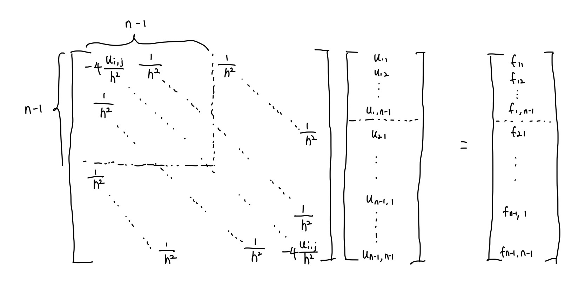
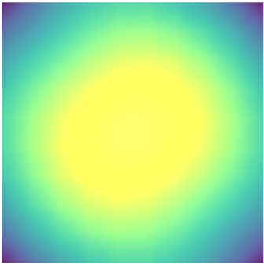

# Linear Solver for Possion's Equation

Steven Shi, Jack Klawitter

## 1. Poisson Equation
In this project, we implemented a  numerical solver for the Poisson Equation in two-dimensions. Our method extend the 1D finite difference method into 2D by modifying coefficients in our sparse matrix to account for the added dimension.

Poisson's Equation is $ \nabla^{2} u = f(x, y)$. We use the finite differences method to approximate our partial derivatives as $$\frac{\partial^{2}u}{\partial x^2} = \frac{u_{i+1,j}- 2u_{i,j}+u_{i-1,j}}{h^2}$$ and $$ \frac{\partial^{2}u}{\partial y^2} = \frac{u_{i,j+1} - 2u_{i,j} + u_{i, j-1}}{h^2}$$ With the sum of these two giving us our final approximation for each point as $$ f_{i, j} = \frac{u_{i+1,j}- 4u_{i,j}+u_{i-1,j} + u_{i,j+1} + u_{i, j-1}}{h^2}$$

We can then express our problem as the system of equations

  

We solved this equation using both Solve_NL and Philip's implementation of the Jacobi method. 

For Poisson Equation with tested our solver with two types of initial conditions:

$$U(x,y) = sin(\pi x)cos(\pi y)$$

and

$$U(x,y) = \frac{1}{2}x(1-x) + \frac{1}{2}y(1-y)$$

These two theoretical solution in turn can gives us the following sourcing functions by calculating Poisson's Equation analytically,

$$f(x,y) = 2\pi^2 sin(\pi x) cos(\pi y)$$

and

$$f(x,y) = 2$$

The trig boundary conditions returned the following result when visualized using the vertex field in webgl:

  

and the other returned:

  

For both sets of boundary conditions, we calculated the error in our solution when compared to the analytic solution and the runtime for our algorithm for grids of different sizes. Interestingly, our error did not increase with a larger grid. In the case of the non-trig boundary conditions, it actually increased. This is what we anticipated since our derivative approximations would be better. We weren't able to figure out why this was. We do see the anticipated increase in runtime.

| Grid Size (nxn)     | Trig Error | Trig Runtime| non-trig Error | non-trig runtime |
| ----------- | ----------- |----------- |----------- |----------- |
| 5     | 0.488443     | 0.03s|0.0249025| 0.02s|
| 10    | 0.48775     | 0.06s|0.0270634| 0.06s|
| 20     | 0.488895     | 0.45s| 0.0514063| 0.37s|
| 100    | 0.499952     | 5.82s|0.156561| 5.91s|

## 2. Convection-diffusion Equation

We also implemented a solver for the convection-diffusion equation. This equation is very similar to the above, but includes one additional term (the convection term). In it's full form, it is $$ c\nabla u - \nabla^{2} u = f(x, y) $$ where $c$ is the conductivity of the material. We just played around with it until achieving desireable results rather than trying to simulate any specific material. 

To discretize the convection-diffusion equation, we again applied the Finite-Difference Method. The general idea is to replace each derivative with its approximation, then the coefficients are computed and added to the matrix A. So final approximation for each point can be expressed as $$ f_{i, j} = \frac{(h+2)u_{i+1,j}- 8u_{i,j}+(2-h)u_{i-1,j} + (h+2)u_{i,j+1} + (2-h)u_{i, j-1}}{2h^2}$$

The application of this was very similar to above, and just required a slight alteration of the values in our sparse matrix to account for the additional derivatives that were being taken. For the same trigonometric boundary conditions as above, we determined the visual result of:

  

We similarly calculated the error and runtime for grids of various sizes. These results are shown below.
| Grid Size (nxn)     | Error | Runtime|
| ----------- | ----------- |----------- |
| 5     | 0.495006    | 0.01s|
| 10    | 0.497202     | 0.06s|
| 20     | 0.499257     | 0.34s|
| 100    | 0.499975     | 2.72s|

Our error was very similar to solving Poisson's equation, but our run time was actually faster when solving the convection-diffusion equation.

## Reference
A. Albaiz, “High-Order Finite-Difference Discretization for Steady-State Convection-Diffusion Equation on Arbitrary Domain,” May 2014. 

Q. Wang, Finite difference for Poisson's Equation. 2019.  

P. Caplan, “Implementation of the multigrid method on central and graphics processing units,” May 2014. 
